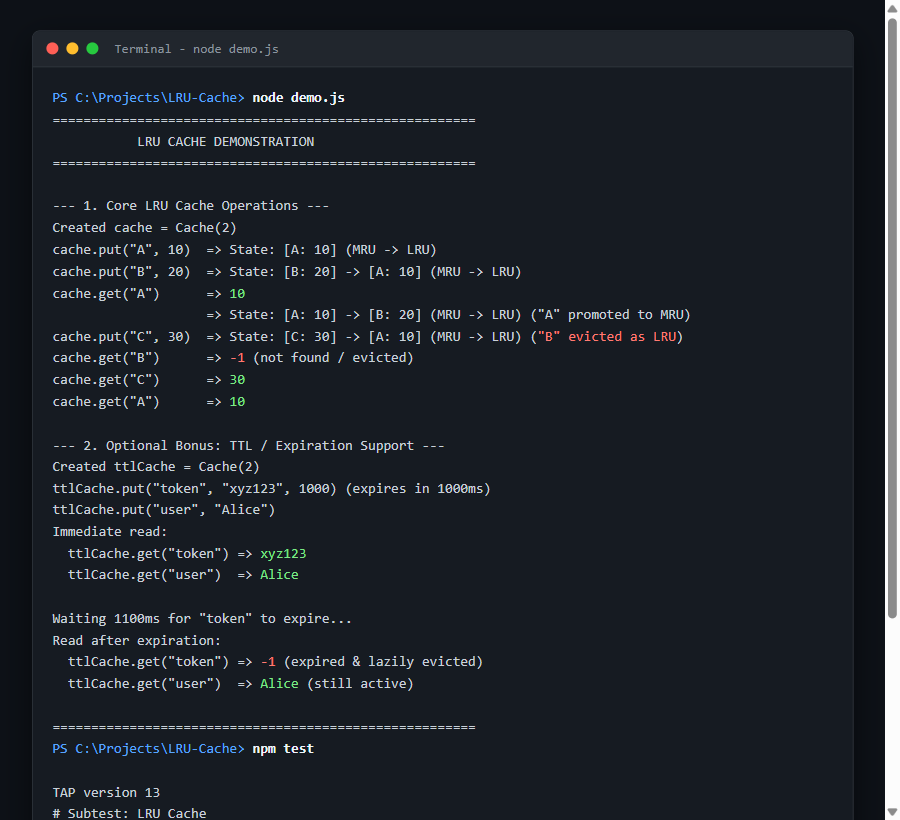

# Least Recently Used (LRU) Cache

A clean and lightweight JavaScript implementation of a Least Recently Used (LRU) Cache with zero external dependencies, supporting $\mathcal{O}(1)$ time complexity for both `get()` and `put()` operations, plus optional Time-To-Live (TTL) expiration.

---

## Program Output Screenshot

Here is the actual program output from running `node demo.js` and `npm test`, showing `put()`, `get()`, LRU eviction, return values, and TTL expiration:



---

## Data Structures Used & Why

This implementation uses a combination of a **Hash Map** and a **Doubly Linked List**:

1. **Hash Map (`Map`)**:
   - Stores `key -> Node` mappings.
   - Provides $\mathcal{O}(1)$ instant access to any cached entry by key without iterating through the list.

2. **Doubly Linked List (with Sentinel Head & Tail)**:
   - Maintains the recency order of entries.
   - Sentinel `head` points to the **Most Recently Used (MRU)** item.
   - Sentinel `tail` points to the **Least Recently Used (LRU)** item.
   - Unlike an array (which requires $\mathcal{O}(N)$ shifting) or a singly linked list (which requires $\mathcal{O}(N)$ traversal to find the predecessor), a doubly linked list allows removing and moving any node in strict $\mathcal{O}(1)$ time by simply updating the adjacent `prev` and `next` pointers.

---

## How LRU Ordering is Maintained

- **Sentinel Nodes**: Dummy `head` and `tail` nodes eliminate edge cases when inserting into an empty list or evicting the last element.
- **On `get(key)`**: If found (and not expired), the accessed node is unlinked from its current position and moved right after `head` (MRU position).
- **On `put(key, value)`**:
  - If the key exists, its value is updated and moved to the MRU position.
  - If the key is new:
    - If the cache has reached capacity, the node at `tail.prev` (the LRU entry) is removed from both the linked list and the map.
    - The new node is inserted right after `head` (MRU position) and added to the map.

---

## Time & Space Complexity

- **Time Complexity**:
  - `get(key)`: $\mathcal{O}(1)$ average and worst-case.
  - `put(key, value)`: $\mathcal{O}(1)$ average and worst-case.
- **Space Complexity**:
  - $\mathcal{O}(C)$ where $C$ is the positive capacity of the cache. The hash map and linked list each store at most $C$ items.

---

## Optional Bonus: TTL / Expiration Support

- **Approach**: Entries can take an optional `ttl` (in milliseconds) via `put(key, value, ttl)`. Expiration is evaluated **passively (lazily)** on `get()`. When an expired key is accessed, it is removed from the linked list and hash map in $\mathcal{O}(1)$ time and returns `-1`.
- **Trade-offs**:
  - *Passive (lazy) eviction* introduces zero background CPU or timer overhead, making it fast and preventing event-loop leaks in long-running applications.
  - *Trade-off*: Expired entries that are never read again remain in memory until evicted by capacity when new entries arrive.

---

## How to Run

### Requirements
- Node.js (version 18+ recommended)

### 1. Run the Demonstration
```bash
node demo.js
# or
npm start
```

### 2. Run the Tests
```bash
node test.js
# or
npm test
```
