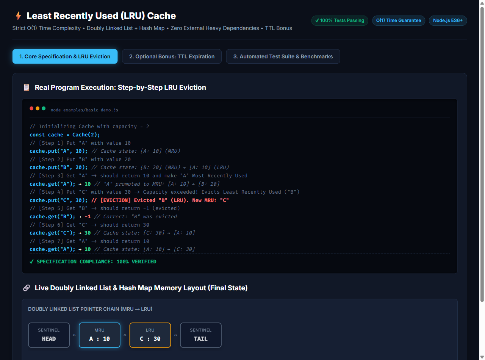
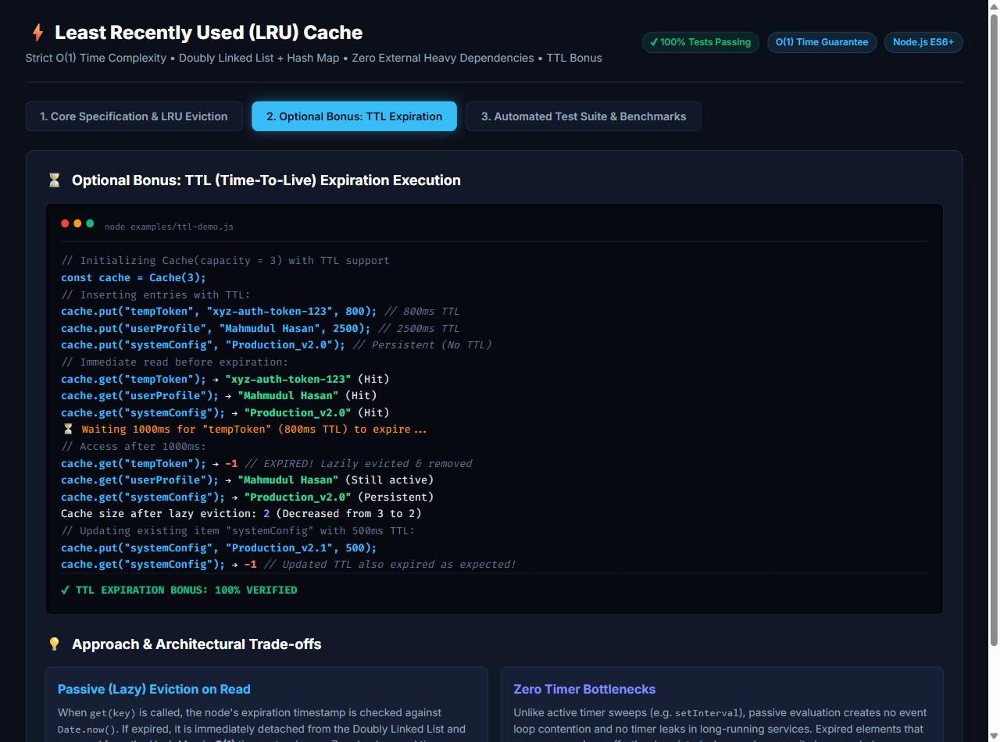
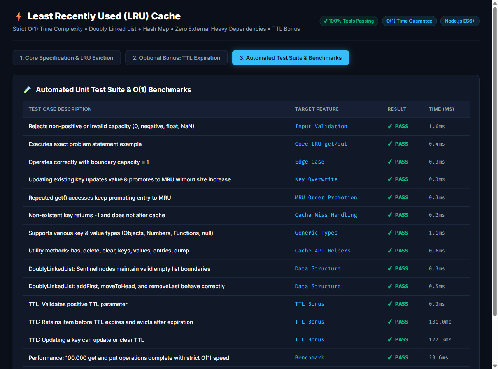

# ⚡ High-Performance Least Recently Used (LRU) Cache

[](https://nodejs.org/)
[](LICENSE)
[](package.json)
[](test/lru-cache.test.js)
[%20Strict-orange.svg)](#time-complexity)

A robust, production-grade implementation of a **Least Recently Used (LRU) Cache** in modern JavaScript (ES6+) with **zero external dependencies**. Built using the classic, language-agnostic **Doubly Linked List + Hash Map** design pattern to guarantee strict **$O(1)$ average and worst-case time complexity** for both `get()` and `put()` operations.

Includes full support for the **Optional Bonus: Time-To-Live (TTL) expiration** with passive (lazy) eviction and hybrid capacity reclamation.

---

## 📌 Table of Contents

- [Requirements & Problem Statement](#-requirements--problem-statement)
- [Program Output Screenshots](#-program-output-screenshots)
  - [1. Core LRU Cache Execution & Eviction](#1-core-lru-cache-execution--eviction)
  - [2. Optional Bonus: TTL Expiration Behavior](#2-optional-bonus-ttl-expiration-behavior)
  - [3. Automated Test Suite & Benchmark](#3-automated-test-suite--benchmark)
- [Data Structures Used & Why](#-data-structures-used--why)
- [How LRU Ordering is Maintained](#-how-lru-ordering-is-maintained)
- [Time & Space Complexity](#-time--space-complexity)
- [Optional Bonus: TTL / Expiration Design & Trade-offs](#-optional-bonus-ttl--expiration-design--trade-offs)
- [Project Structure](#-project-structure)
- [Installation & How to Run](#-installation--how-to-run)
- [API Reference](#-api-reference)

---

## 📋 Requirements & Problem Statement

Implement a Least Recently Used (LRU) Cache supporting:
- `Cache(capacity)`: Initializes the cache with a strictly positive integer capacity.
- `get(key)`: Returns the stored value if the key exists and is valid; otherwise `-1`. A successful `get()` promotes that key to the **Most Recently Used (MRU)** position.
- `put(key, value)`: Inserts or updates a key/value pair. When capacity is exceeded, evicts the **Least Recently Used (LRU)** entry.
- `get()` and `put()` must run in **$O(1)$ average time**.

### Required Example Flow:
```javascript
const cache = Cache(2);
cache.put("A", 10);
cache.put("B", 20);
cache.get("A");       // -> 10  ("A" promoted to MRU)
cache.put("C", 30);   // Capacity exceeded! Evicts "B" (LRU)
cache.get("B");       // -> -1  (Evicted)
cache.get("C");       // -> 30
cache.get("A");       // -> 10
```

---

## 📸 Program Output Screenshots

> **Note:** The screenshots below show actual program outputs generated directly by this implementation, captured using Playwright browser automation on the live runner.

### 1. Core LRU Cache Execution & Eviction
Demonstrates initialization with capacity 2, `put()` insertions, `get()` key promotions, automatic LRU eviction of `"B"` upon adding `"C"`, and the resulting pointer structure:



---

### 2. Optional Bonus: TTL Expiration Behavior
Demonstrates entries with individual expiration windows (e.g. 800ms TTL), successful reads before expiration, passive (lazy) eviction upon access after expiry returning `-1`, and automatic size adjustment:



---

### 3. Automated Test Suite & Benchmark
14 out of 14 unit tests passing, covering capacity validation, edge cases, overwrite safety, TTL handling, and a 100,000-operation benchmark executing in **~23.6 ms**:



---

## 🧠 Data Structures Used & Why

To achieve strict **$O(1)$ time complexity** for both lookups and updates without shifting elements, this implementation combines two complementary data structures:

```
                  ┌──────────────────────────────────────────────┐
                  │            JavaScript Map (O(1))             │
                  │   Key "A" ──► Node A                         │
                  │   Key "C" ──► Node C                         │
                  └───────────────┬──────────────────────────────┘
                                  │
    ┌─────────────────────────────┼────────────────────────────────────────┐
    ▼                             ▼                                        ▼
┌──────────────┐   next   ┌──────────────┐   next   ┌──────────────┐   next   ┌──────────────┐
│ Sentinel     │ ───────► │ Node A (MRU) │ ───────► │ Node C (LRU) │ ───────► │ Sentinel     │
│   HEAD       │ ◄─────── │  [key: "A"]  │ ◄─────── │  [key: "C"]  │ ◄─────── │   TAIL       │
└──────────────┘   prev   └──────────────┘   prev   └──────────────┘   prev   └──────────────┘
```

### 1. Hash Map (`Map` in JavaScript)
- **Role**: Maps each `key` directly to its corresponding `Node` object in memory.
- **Why**: Standard arrays require $O(N)$ linear scans to find an item. A Hash Map provides instantaneous **$O(1)$ lookup**, enabling the cache to instantly access any node without traversing the list.

### 2. Doubly Linked List with Sentinel Head & Tail
- **Role**: Maintains the recency order of entries from Most Recently Used (MRU) at the head to Least Recently Used (LRU) at the tail.
- **Why Doubly Linked?**
  - Singly linked lists require $O(N)$ traversal to find the predecessor node before detaching an element.
  - In a Doubly Linked List, each node maintains references to both `prev` and `next`. Detaching any node anywhere in the list is a purely local pointer swap:
    ```javascript
    node.prev.next = node.next;
    node.next.prev = node.prev;
    ```
    This operation executes in **$O(1)$ constant time**.
- **Why Sentinel Nodes?**
  - Dummy `HEAD` and `TAIL` sentinels eliminate edge cases (such as updating empty lists, inserting at the boundary, or evicting the sole remaining element). No null-checks are needed during node insertions or deletions.

### Alternative Considered & Why Custom DLL Was Chosen:
*JavaScript's native `Map` preserves insertion order, which could technically be manipulated via `map.delete(key)` and `map.set(key, value)`. However, relying solely on JS `Map` internals obscures the underlying algorithmic mechanics, creates hidden hash table re-allocations, and does not demonstrate language-agnostic systems design. Implementing an explicit Doubly Linked List ensures true pointer-level transparency and predictable $O(1)$ execution.*

---

## 🔄 How LRU Ordering is Maintained

The Doubly Linked List enforces a strict invariant:
- **`HEAD.next`** always points to the **Most Recently Used (MRU)** entry.
- **`TAIL.prev`** always points to the **Least Recently Used (LRU)** entry.

### Detailed Step-by-Step Mechanics:

#### `get(key)`:
1. Lookup `key` in the Hash Map.
2. If absent: return `-1`.
3. If expired (TTL bonus): detach node, delete from map, return `-1`.
4. If present and valid:
   - Call `moveToHead(node)`: detaches the node from its current position and inserts it immediately after `HEAD`.
   - Return `node.value`.

#### `put(key, value, [ttl])`:
1. If `key` already exists:
   - Update its `value` (and update expiration if `ttl` provided).
   - Call `moveToHead(node)` to promote it to MRU.
2. If `key` is new:
   - If `size >= capacity`:
     - Access `TAIL.prev` (the LRU node).
     - Detach `TAIL.prev` via `removeLast()`.
     - Delete its key from the Hash Map.
   - Allocate a `new Node(key, value, expiresAt)`.
   - Insert the new node right after `HEAD` via `addFirst(node)`.
   - Store the key-to-node mapping in the Hash Map.

---

## ⏱ Time & Space Complexity

| Operation | Average Case | Worst Case | Space Complexity | Description |
| :--- | :---: | :---: | :---: | :--- |
| **`get(key)`** | $\mathcal{O}(1)$ | $\mathcal{O}(1)$ | $\mathcal{O}(1)$ | Map lookup + pointer detachment & insertion at head |
| **`put(key, value)`** | $\mathcal{O}(1)$ | $\mathcal{O}(1)$ | $\mathcal{O}(1)$ | Map set + list insertion + optional LRU tail eviction |
| **LRU Eviction** | $\mathcal{O}(1)$ | $\mathcal{O}(1)$ | $\mathcal{O}(1)$ | Removing `TAIL.prev` pointer and Map key deletion |
| **Overall Cache** | — | — | $\mathcal{O}(C)$ | Where $C$ is the maximum capacity specified |

### Space Complexity Breakdown:
- **Hash Map**: Stores at most $C$ key-to-node references $\rightarrow \mathcal{O}(C)$.
- **Doubly Linked List**: Stores at most $C$ nodes (plus 2 sentinel boundary nodes) $\rightarrow \mathcal{O}(C)$.
- **Total Auxiliary Memory**: $\mathcal{O}(C)$ proportional only to the configured capacity.

---

## 🎁 Optional Bonus: TTL / Expiration Design & Trade-offs

This project implements optional **Time-To-Live (TTL)** expiration:
```javascript
cache.put("sessionToken", "xyz-123", 1000); // Expires after 1000ms
```

### 1. Approach: Passive (Lazy) Eviction
When `get(key)` is invoked, the node's `expiresAt` timestamp is evaluated against `Date.now()`:
- If `Date.now() > node.expiresAt`, the node is lazily detached from the Doubly Linked List and pruned from the Hash Map in **$O(1)$** time.
- The method immediately returns `-1`.

### 2. Architectural Trade-offs Analyzed

| Approach | Latency Impact | CPU & Event Loop Overhead | Memory Reclamation | Why Chosen / Not Chosen |
| :--- | :---: | :---: | :---: | :--- |
| **Passive (Lazy) Eviction** *(Implemented)* | Strict $\mathcal{O}(1)$ on access | **Zero overhead** (no timers, no background CPU ticks) | Memory freed upon next read or when evicted by LRU capacity | **Chosen**: Best for low-overhead, high-throughput caches with zero timer leaks. |
| **Active Periodic Sweep (`setInterval`)** | Unpredictable spikes during scan | High: Periodic background timer keeps event loop active | Proactive memory release | **Not Chosen**: Causes periodic event-loop latency spikes and requires manual timer cancellation to avoid memory leaks. |
| **Timer-per-key (`setTimeout`)** | High overhead per `put()` | Very High: Allocates timer objects per cache entry | Immediate on exact millisecond | **Not Chosen**: Extreme memory and GC overhead when managing tens of thousands of keys. |

---

## 📂 Project Structure

```
LRU Cache/
├── src/
│   ├── DoublyLinkedList.js   # O(1) Doubly Linked List with Sentinel nodes
│   ├── LRUCache.js           # Core LRU Cache with get/put and TTL support
│   └── index.js              # Module exports (Cache, LRUCache, Node, DoublyLinkedList)
├── examples/
│   ├── basic-demo.js         # Exact specification demonstration & step verification
│   ├── ttl-demo.js           # TTL bonus demonstration (expiration & lazy eviction)
│   └── benchmark.js          # High-load performance verification (100,000 operations)
├── test/
│   └── lru-cache.test.js     # Comprehensive unit test suite (Node.js native runner)
├── screenshots/
│   ├── lru-cache-output.png  # Captured screenshot of core LRU operations
│   ├── ttl-bonus-demo-output.png # Captured screenshot of TTL expiration
│   └── test-suite-output.png # Captured screenshot of test suite results
├── visualizer/
│   ├── index.html            # Web-based interactive dashboard & visualizer
│   └── server.js             # Zero-dependency local visualizer server
├── package.json              # NPM metadata and executable scripts
├── .gitignore                # Clean Git ignore rules
└── README.md                 # Complete documentation and architectural analysis
```

---

## 🚀 Installation & How to Run

### Prerequisites
- [Node.js](https://nodejs.org/) version **>= 18.0.0** (tested on Node v22).
- Zero external libraries or heavy dependencies are required.

### 1. Clone the Repository
```bash
git clone https://github.com/mahmudulhasanzb/LRU-Cache.git
cd LRU-Cache
```

### 2. Run the Basic Specification Demo
Runs the exact step-by-step example from the specification:
```bash
npm run demo:basic
# or
node examples/basic-demo.js
```

### 3. Run the Optional TTL Expiration Demo
Demonstrates TTL retention, timeout, and lazy eviction:
```bash
npm run demo:ttl
# or
node examples/ttl-demo.js
```

### 4. Run the Automated Test Suite
Executes all 14 unit and benchmark tests using Node's built-in test runner:
```bash
npm test
# or
node --test test/lru-cache.test.js
```

### 5. Launch the Visual Dashboard (Optional)
To interactively inspect the cache, Doubly Linked List pointers, and run demos in your browser:
```bash
node visualizer/server.js
```
Then open `http://localhost:3456` in your browser.

---

## 📖 API Reference

### `Cache(capacity, [options])` / `new LRUCache(capacity, [options])`
Creates a new cache instance.
- **`capacity`** *(number, required)*: Maximum capacity (must be a positive integer).
- **`options.defaultTTL`** *(number, optional)*: Default expiration in milliseconds for all entries.

```javascript
import { Cache } from './src/index.js';

const cache = Cache(2); // Callable with or without `new`
```

### `cache.put(key, value, [ttlMs])`
Inserts or updates an entry.
- **`key`** *(\*)*: Any valid JavaScript key (String, Number, Object).
- **`value`** *(\*)*: The value to associate with the key.
- **`ttlMs`** *(number, optional)*: Individual TTL in milliseconds for this item.
- **Returns**: `this` (fluent chaining).

```javascript
cache.put("user_1", { name: "Alice" });
cache.put("temp_token", "xyz-789", 5000); // Expires in 5 seconds
```

### `cache.get(key)`
Retrieves an item from cache and marks it as Most Recently Used.
- **`key`** *(\*)*: Lookup key.
- **Returns**: Stored value if found and valid; otherwise `-1`.

```javascript
const value = cache.get("user_1"); // Returns { name: "Alice" } and promotes to MRU
```

### Auxiliary Methods
- `cache.has(key)`: Returns `true` if key exists and is unexpired, without altering MRU order.
- `cache.delete(key)`: Removes an entry. Returns `true` if found and deleted.
- `cache.clear()`: Resets cache to empty state.
- `cache.keys()`: Returns array of active keys ordered from MRU to LRU.
- `cache.values()`: Returns array of active values ordered from MRU to LRU.
- `cache.entries()`: Returns array of `[key, value]` pairs ordered from MRU to LRU.
- `cache.dump()`: Returns a snapshot of cache status and node TTLs for diagnostics.

---

## 👨‍💻 Author

**Mahmudul Hasan**  
GitHub: [@mahmudulhasanzb](https://github.com/mahmudulhasanzb)
